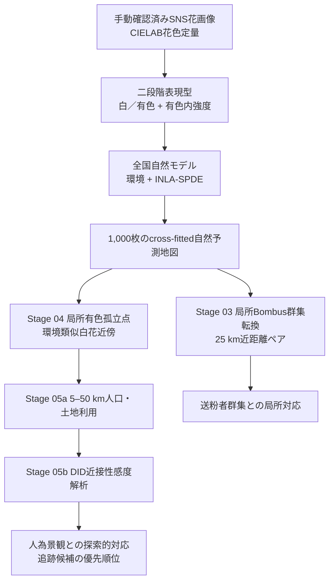

# ホタルブクロ花色研究：投稿解析計画

## 確定した推論構造

この研究の最終解析は、次の4層に固定する。



確認的解析、計画された局所機構解析、探索的人為景観解析を同じ
検定階層として混ぜない。

## 第1層：二段階花色表現型

### 色素発現

- 応答：各1-kmセルの有色画像数／全画像数
- 全1,923画像を使用する
- 応答盲検のa*混合分布境界を使用する
- 白花のa*変動をアントシアニン量として解釈しない

### 有色花内強度

- 有色観測があるセルだけを対象にする
- 応答：有色花内の光学的花色強度
- 白花と有色花を一つの連続a*応答へ戻さない

最終データは白花966、有色花957である。色抽出前に著者が対象花と
抽出領域を目視確認したことをMethodsに明記する。

## 第2層：全国自然モデル

Stage 02のcross-fitted環境＋INLA-SPDEモデルを自然基準とする。

- 解析単位：1-kmセル、1,307セル
- 空間検証：50-km spatial folds
- 自然説明変数：応答を見ずに構成した環境軸
- 空間項：未測定の連続地理・分布史を表現するSPDE
- 予測複製：各応答について1,000地図
- 残差を新たな主応答にしない

全国有色発現モデルのcross-fitted AUCは0.862である。有色花内強度の
RMSEは0.914である。AUCは因果機構の強さではなく、空間hold-outでの
識別性能としてのみ報告する。

Bombus fingerprintを全国モデルへ追加した平均AUC改善は0.0061に
とどまる。したがって「Bombusが全国分布を独立に大きく改善した」とは
主張しない。

## 第3層：局所Bombus群集転換

事前に定義した局所ペア部分を、最終的な送粉者解析として
採用する。

### ペアの構成

- node：5種ENMeval予測がすべて存在する1-kmセル
- 花色を見ず、各セルから近い5セルまでを結ぶ
- 同じheld-out spatial fold内だけを結ぶ
- 主尺度：25 km
- 感度解析：10 km、50 km
- 無向重複ペアを除く

### 花色転換応答

1. セル端点間の有色率の絶対差
2. 両端点に有色観測がある場合だけ、有色花内強度の絶対差

### Bombus説明変数

5種を独立した効果として同時投入しない。次の3軸をまとめた
予測群集fingerprintの端点間距離を主推定量とする。

- 5種の総生息適地support
- 予測種組成PC1
- 予測種組成PC2

これはアバンダンス、訪花頻度、送粉効率、選択圧の直接測定ではない。

### 自然地理との交絡

観測ペアと1,000自然予測地図の両方で、同じedge、距離、環境差、
自然期待花色差、観察数、共有node依存を用いて部分統計量を再計算する。
長野・高地・気候帯などへのBombusと花色の共分布は、自然帰無分布へ
含める。

### 確定結果

25-km主尺度では、

- 有色率転換：partial beta=0.084、未補正p=0.028、
  2応答BH q=0.028
- 有色花内強度転換：partial beta=0.092、未補正p=0.014、
  2応答BH q=0.028

したがって、

> 予測Bombus群集fingerprintの局所転換は、自然モデル、測定環境、
> 連続空間構造および観察設計から生成される対応より強く、白／有色率
> 転換と有色花内強度転換の両方に並行した。

とは記述できる。

一方で「Bombus転換が花色転換を引き起こした」「特定種が独立に作用
した」「予測値が個体数を表す」とは記述しない。

## 第4層：自然モデル逸脱と人為景観

### Stage 04：候補の固定

主候補は、次の条件だけで固定する。

- 有色花がある1-kmセル
- 10 km以内に最低3セル
- 4つの自然環境PCのRMS距離が1以下
- 適格な実観測近傍がすべて白花

人口、土地利用、DID、DOY、濃色性は候補選択へ使わない。

主定義では候補16地点で、自然地図平均13.507地点、p=0.273である。
候補割合も観測0.0448、自然地図平均0.0341、p=0.125である。したがって
孤立点そのものが自然モデルより過剰とは主張しない。

### Stage 05a：局所人口

各有色孤立点を、その候補を定義した環境類似白花近傍と直接比較する。

- 5-km人口rank差：0.059
- 未補正p=0.022
- 5距離maxT補正p=0.076
- 25–50 kmでは同じ傾向は弱い

これは広い都市圏勾配ではなく、5–10 kmの局所居住地近接傾向を示唆
するが、補正後0.05を超える。

### Stage 05b：DID感度解析

- 人口×DID近接性差：0.054
- 未補正p=0.029
- 5指標maxT補正p=0.084
- DID近傍・人口上位の候補：9/16
- 自然地図での平均候補割合：0.313
- クラス比較maxT補正p=0.117

人口×DID合成値は入力変数とSpearman rho約0.97であり、独立した効果
ではなく収束の要約としてのみ扱う。

一地点 `cell-1km--108_-147` は、予測外有色化q=0.069とDID近接
スパイク上位10%を同時に満たした。しかし早咲q=0.943、濃色q=0.194
であり、園芸表現型の多面的収束は認めない。

## 最終的に除外する解析枝

次は最終推論へ含めない。

- 削除済みの単一巨大R Markdownに埋め込まれた旧結果
- 全花連続a*を一応答にした解析
- 白花a*をアントシアニン量とみなす解釈
- 自然予測段階に人為変数を混ぜた旧園芸tier解析
- 極端値random forestを最終証拠とする解析
- 旧matched-control園芸診断と早咲・濃色収束検定
- 残差を目的変数にした二段階回帰
- 5種Bombusの独立係数解釈
- 送粉者の因果的選択圧、人為的植栽、園芸由来、逸出、交雑、
  遺伝子汚染の断定

景観特徴量モジュールはStage 04–05が利用する応答盲検の特徴量作成に
だけ残し、その
極端値推論は採用しない。

## 論文の最終ストーリー

1. 手動確認したSNS画像から、広域の量的花色表現型を構築した。
2. 白／有色発現と有色花内強度を分離することで、色素欠如と色素量の
   勾配を混同しなかった。
3. 全国の環境軸とSPDEにより、大きな環境勾配と連続地理・分布史を
   自然基準として定量した。
4. 全国モデルへのBombus追加効果は小さかったが、推論尺度を局所
   ペアへ変えると、予測群集転換と二段階花色転換の対応が自然予測
   複製を上回った。
5. 自然モデルから外れる局所有色点を、残差回帰ではなく固定した
   局所イベントとして抽出した。
6. それらは人口・DID近接方向を示したが、補正後有意ではなく、
   人為影響の探索的手掛かりと追跡候補に限定した。
7. 園芸由来の検証は、栽培履歴、現地確認、標本、集団遺伝解析へ
   引き渡す。

新規性は、単独のSPDE、花色定量、Bombus SDMのいずれかではなく、
SNS由来の二段階量的表現型を、全国自然基準、局所群集転換、自然予測
複製、人為景観候補化へ、推論尺度と主張上限を混同せず接続した点にある。

## 実行

既存の自然モデル・チェックポイントからStage 03–06を再生成する通常実行：

```powershell
& 'C:\Program Files\R\R-4.5.3\bin\Rscript.exe' `
  scripts/run_publication_pipeline.R `
  --mode=extensions --tests=true
```

既存結果の検証だけを行う場合：

```powershell
& 'C:\Program Files\R\R-4.5.3\bin\Rscript.exe' `
  scripts/run_publication_pipeline.R `
  --mode=verify --tests=true
```

固定セル表から自然予測モデルと特徴量作成も再実行する場合は
`--mode=full`を使う。画像抽出、表現型データ、固定セル表は
手動確認済みの上流入力として監査する。

## 最終ロック出力

- `results/final_analysis_pipeline/final_result_registry.csv`
- `results/final_analysis_pipeline/final_claim_registry.csv`
- `results/final_analysis_pipeline/final_exclusion_registry.csv`
- `results/final_analysis_pipeline/final_input_checksums.csv`
- `results/final_analysis_pipeline/final_stage_manifest.csv`
- `results/final_analysis_pipeline/publication_stage_registry.csv`
- `results/final_analysis_pipeline/VALIDATION.md`
- `results/final_analysis_pipeline/AUDIT.md`
